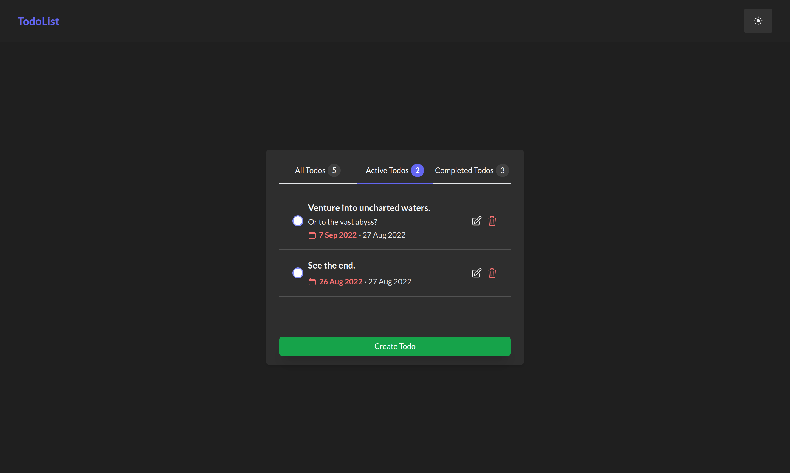

# React Todo

## Dependencies

- [Headless UI](https://headlessui.com/)
- [React Hook Form](https://react-hook-form.com/)
- [Zustand](https://zustand-demo.pmnd.rs/)
- [Tailwind](https://tailwindcss.com/) w/ [@tailwindcss/forms](https://github.com/tailwindlabs/tailwindcss-forms)
